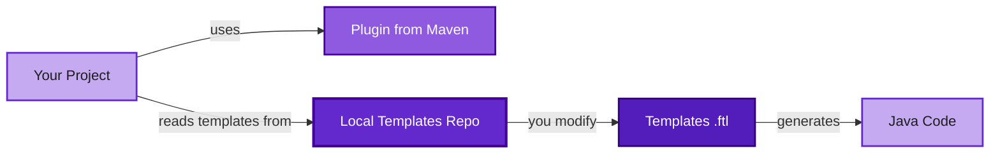
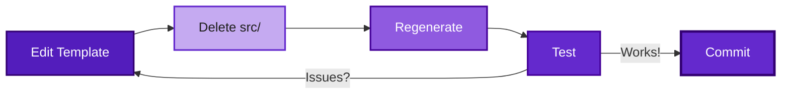
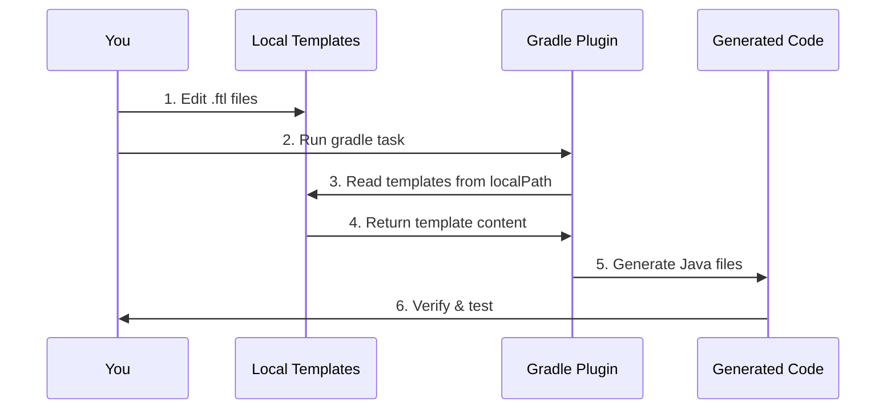
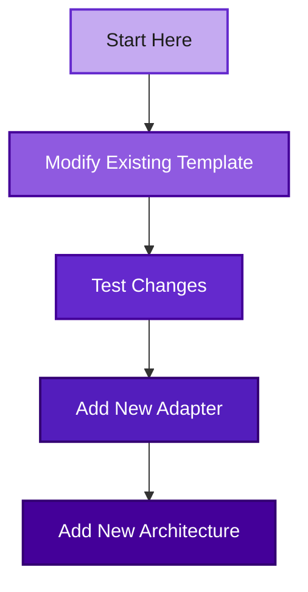

# Contributing Templates

Quick guide to contribute templates without modifying the core plugin.

## 🎯 Overview



> 💡 **Tip:** You only need the templates repository! The plugin is already published.

## Prerequisites

- Git
- Java 21+
- A project using the plugin (or create a new one)

## 🚀 Quick Start

### Step 1: Fork and Clone Templates Repository

```bash
# Fork on GitHub: https://github.com/somospragma/backend-architecture-design-archetype-generator-templates

# Then clone YOUR fork:
git clone https://github.com/YOUR-USERNAME/backend-architecture-design-archetype-generator-templates.git
cd backend-architecture-design-archetype-generator-templates
```

### Step 2: Create Your Feature Branch

```bash
git checkout -b feature/add-mongodb-adapter
```

### Step 3: Make Your Changes

Edit or create templates in the `templates/` directory:

```bash
# Example: Adding a MongoDB adapter
cd templates/frameworks/spring/reactive/adapters/driven-adapters
mkdir mongodb
cd mongodb

# Create your template files
touch Adapter.java.ftl
touch Config.java.ftl
touch Entity.java.ftl
touch metadata.yml
```

### Step 4: Create or Use a Test Project

> 💡 **Tip:** You don't need to clone the core plugin! Just create a new project.

```bash
mkdir ~/test-mongodb-adapter
cd ~/test-mongodb-adapter
```

Create `build.gradle.kts`:

```kotlin
plugins {
    id("com.pragma.archetype-generator") version "0.1.15-SNAPSHOT"
}
```

Create `settings.gradle.kts`:

```kotlin
rootProject.name = "test-mongodb-adapter"

pluginManagement {
    repositories {
        mavenLocal()
        gradlePluginPortal()
    }
}
```

### Step 5: Configure Local Templates

Create `.cleanarch.yml` and point to your local templates:

```yaml
project:
  name: test-mongodb-adapter
  basePackage: com.example.test
  pluginVersion: 0.1.15-SNAPSHOT
  createdAt: 2026-01-31T10:00:00

architecture:
  type: hexagonal-single
  paradigm: reactive
  framework: spring

# 👇 This is the key! Point to your local templates
templates:
  mode: developer
  localPath: /Users/yourname/backend-architecture-design-archetype-generator-templates/templates
  cache: false
```

> ⚠️ **Important:** Use the **absolute path** to your cloned templates directory.

### Step 6: Initialize Project

```bash
./gradlew initCleanArch --packageName=com.example.test
```

You should see:

```
✓ Using local templates from .cleanarch.yml: /path/to/templates
✓ Project initialized successfully!
```

> ✅ **Success!** Your project is now using your local templates.

### Step 7: Test Your Templates

Generate components using your templates:

```bash
# Test entity generation
./gradlew generateEntity --name=Product --fields="name:String,price:BigDecimal" --hasId

# Test adapter generation (your new MongoDB adapter)
./gradlew generateOutputAdapter --name=ProductRepository --type=mongodb --entity=Product

# Verify generated files
find src -name "*.java"
```

### Step 8: Verify Compilation

```bash
./gradlew build -x test
```

✅ If it compiles successfully, your templates are working!

### Step 9: Iterate on Your Changes



> 💡 **Tip:** No need to rebuild anything! Just edit → regenerate → test.

**Quick iteration:**

1. Edit your template files
2. Delete generated files: `rm -rf src/`
3. Regenerate: `./gradlew initCleanArch --packageName=com.example.test`
4. Test again

### Step 10: Commit and Push

```bash
cd /path/to/backend-architecture-design-archetype-generator-templates

git add templates/
git commit -m "feat: add MongoDB adapter support"
git push origin feature/add-mongodb-adapter
```

### Step 11: Create Pull Request

1. Go to GitHub
2. Open a Pull Request from your fork to the main repository
3. Describe your changes
4. Wait for review

## 📊 How It Works



## 🎨 Common Scenarios

### Scenario 1: Adding a New Adapter

**What you need:**

```
templates/frameworks/spring/reactive/adapters/driven-adapters/mongodb/
├── Adapter.java.ftl       # Main adapter implementation
├── Config.java.ftl        # Configuration class
├── Entity.java.ftl        # Data entity
├── Test.java.ftl          # Unit tests
└── metadata.yml           # Adapter metadata
```

**Update index:**

Edit `templates/frameworks/spring/reactive/adapters/driven-adapters/index.json`:

```json
{
  "adapters": [
    {
      "type": "redis",
      "name": "Redis Cache",
      "description": "Reactive Redis adapter"
    },
    {
      "type": "mongodb",
      "name": "MongoDB",
      "description": "Reactive MongoDB adapter"
    }
  ]
}
```

**Test:**

```bash
./gradlew generateOutputAdapter --name=UserRepository --type=mongodb --entity=User
```

### Scenario 2: Modifying Existing Template

**Example: Add Lombok to Entity template**

1. **Edit template:**

```bash
cd templates/frameworks/spring/reactive/domain
# Edit Entity.java.ftl
```

Add Lombok annotations:

```java
package ${packageName};

import lombok.Data;
import lombok.NoArgsConstructor;
import lombok.AllArgsConstructor;

@Data
@NoArgsConstructor
@AllArgsConstructor
public class ${entityName} {
  // ... rest of template
}
```

2. **Test:**

```bash
cd ~/test-project
rm -rf src/
./gradlew generateEntity --name=User --fields="name:String,email:String" --hasId
cat src/main/java/com/example/test/domain/model/User.java
```

3. **Verify it has Lombok annotations** ✅

## 📍 Template Locations

| Component | Path |
|-----------|------|
| **Entity** | `frameworks/spring/reactive/domain/Entity.java.ftl` |
| **Use Case** | `frameworks/spring/reactive/usecase/UseCase.java.ftl` |
| **Input Port** | `frameworks/spring/reactive/usecase/InputPort.java.ftl` |
| **Driven Adapter** | `frameworks/spring/reactive/adapters/driven-adapters/{type}/` |
| **Entry Point** | `frameworks/spring/reactive/adapters/entry-points/{type}/` |
| **Architecture** | `architectures/{type}/project/` |

## 🧪 Test Commands

```bash
# Initialize project
./gradlew initCleanArch --packageName=com.example.test

# Generate entity
./gradlew generateEntity --name=Product --fields="name:String,price:BigDecimal" --hasId

# Generate use case
./gradlew generateUseCase --name=CreateProduct --methods="create:Mono:product:Product"

# Generate driven adapter
./gradlew generateOutputAdapter --name=ProductCache --type=redis --entity=Product

# Build
./gradlew build -x test
```

## ⚙️ Configuration Reference

**Minimal `.cleanarch.yml`:**

```yaml
templates:
  mode: developer
  localPath: /absolute/path/to/templates
  cache: false
```

**Full `.cleanarch.yml`:**

```yaml
project:
  name: my-service
  basePackage: com.example.myservice
  pluginVersion: 0.1.15-SNAPSHOT
  createdAt: 2026-01-31T10:00:00

architecture:
  type: hexagonal-single
  paradigm: reactive
  framework: spring

templates:
  mode: developer
  localPath: /Users/david/repos/backend-architecture-design-archetype-generator-templates/templates
  cache: false
```

## 🔧 Troubleshooting

### Templates not being used

**Check Gradle output:**

```
✓ Using local templates from .cleanarch.yml: /path/to/templates
```

If you see "embedded templates", check:

1. ✅ Path is absolute (not relative)
2. ✅ Path points to `templates/` directory
3. ✅ `.cleanarch.yml` syntax is correct

### Template not found

**Error:** `Template not found: frameworks/spring/reactive/domain/Entity.java.ftl`

**Solution:**

```bash
# Verify file exists
ls /path/to/templates/frameworks/spring/reactive/domain/Entity.java.ftl

# Check path in .cleanarch.yml
cat .cleanarch.yml
```

### Generated code doesn't compile

1. Check template syntax
2. Verify all imports are included
3. Test with simple example first

## 💡 Tips & Best Practices

> ✅ **DO:**
> - Use absolute paths in `.cleanarch.yml`
> - Test with simple examples first
> - Commit often
> - Add comments in templates
> - Follow existing template patterns

> ❌ **DON'T:**
> - Use relative paths
> - Modify core plugin (unless necessary)
> - Commit `.cleanarch.yml` with local paths
> - Add complex logic in templates

> 💡 **Pro Tip:** You can have multiple test projects, each pointing to the same local templates directory!

## 🎓 Learning Path



1. **Beginner:** Modify existing template (add Lombok, validation, etc.)
2. **Intermediate:** Add new adapter (MongoDB, Kafka, etc.)
3. **Advanced:** Add new architecture (Onion, Vertical Slice, etc.)

## 📚 Need Help?

- 📖 [Template System Details](./template-system.md)
- 🏗️ [Adding Architecture](./adding-architecture.md)
- 🔌 [Adding Adapter](./adding-adapter.md)
- 💬 [GitHub Discussions](https://github.com/somospragma/backend-architecture-design-archetype-generator-templates/discussions)

## 🎉 Thank You!

Every contribution makes this project better. We appreciate your help!

### 2. Create Your Feature Branch

```bash
git checkout -b feature/add-mongodb-adapter
```

### 3. Make Your Changes

Edit or create templates in the `templates/` directory:

```bash
# Example: Adding a MongoDB adapter
cd templates/frameworks/spring/reactive/adapters/driven-adapters
mkdir mongodb
cd mongodb

# Create your template files
touch Adapter.java.ftl
touch Config.java.ftl
touch Entity.java.ftl
touch metadata.yml
```

### 4. Configure Your Test Project

Create a test project or use an existing one:

```bash
mkdir ~/test-mongodb-adapter
cd ~/test-mongodb-adapter
```

Create `build.gradle.kts`:

```kotlin
plugins {
    id("com.pragma.archetype-generator") version "0.1.15-SNAPSHOT"
}
```

Create `settings.gradle.kts`:

```kotlin
rootProject.name = "test-mongodb-adapter"

pluginManagement {
    repositories {
        mavenLocal()
        gradlePluginPortal()
    }
}
```

### 5. Point to Your Local Templates

Create `.cleanarch.yml`:

```yaml
project:
  name: test-mongodb-adapter
  basePackage: com.example.test
  pluginVersion: 0.1.15-SNAPSHOT
  createdAt: 2026-01-31T10:00:00

architecture:
  type: hexagonal-single
  paradigm: reactive
  framework: spring

# Point to your local templates
templates:
  mode: developer
  localPath: /absolute/path/to/backend-architecture-design-archetype-generator-templates/templates
  cache: false
```

**Important:** Use the absolute path to your cloned templates directory.

### 6. Initialize Project

```bash
./gradlew initCleanArch --packageName=com.example.test
```

You should see:

```
✓ Using local templates from .cleanarch.yml: /path/to/templates
✓ Project initialized successfully!
```

### 7. Test Your Templates

Generate components using your templates:

```bash
# Test entity generation
./gradlew generateEntity --name=Product --fields="name:String,price:BigDecimal" --hasId

# Test adapter generation (your new MongoDB adapter)
./gradlew generateOutputAdapter --name=ProductRepository --type=mongodb --entity=Product

# Verify generated files
find src -name "*.java"
```

### 8. Verify Compilation

```bash
./gradlew build -x test
```

If it compiles successfully, your templates are working!

### 9. Iterate on Your Changes

**No need to rebuild anything!** Just:

1. Edit your template files
2. Delete generated files: `rm -rf src/`
3. Regenerate: `./gradlew initCleanArch --packageName=com.example.test`
4. Test again

### 10. Commit and Push

```bash
cd /path/to/backend-architecture-design-archetype-generator-templates

git add templates/
git commit -m "feat: add MongoDB adapter support"
git push origin feature/add-mongodb-adapter
```

### 11. Create Pull Request

1. Go to GitHub
2. Open a Pull Request from your fork
3. Describe your changes
4. Wait for review

## Common Scenarios

### Adding a New Adapter

**Files to create:**

```
templates/frameworks/spring/reactive/adapters/driven-adapters/mongodb/
├── Adapter.java.ftl       # Main adapter implementation
├── Config.java.ftl        # Configuration class
├── Entity.java.ftl        # Data entity
├── Test.java.ftl          # Unit tests
└── metadata.yml           # Adapter metadata
```

**Update index:**

Edit `templates/frameworks/spring/reactive/adapters/driven-adapters/index.json`:

```json
{
  "adapters": [
    {
      "type": "redis",
      "name": "Redis Cache",
      "description": "Reactive Redis adapter"
    },
    {
      "type": "mongodb",
      "name": "MongoDB",
      "description": "Reactive MongoDB adapter"
    }
  ]
}
```

**Test:**

```bash
./gradlew generateOutputAdapter --name=UserRepository --type=mongodb --entity=User
```

### Modifying Existing Template

**Example: Add Lombok to Entity template**

1. **Edit template:**

```bash
cd templates/frameworks/spring/reactive/domain
nano Entity.java.ftl
```

Add Lombok annotations:

```java
package ${packageName};

import lombok.Data;
import lombok.NoArgsConstructor;
import lombok.AllArgsConstructor;

@Data
@NoArgsConstructor
@AllArgsConstructor
public class ${entityName} {
  // ... rest of template
}
```

2. **Test:**

```bash
cd ~/test-project
rm -rf src/
./gradlew generateEntity --name=User --fields="name:String,email:String" --hasId
cat src/main/java/com/example/test/domain/model/User.java
```

3. **Verify it has Lombok annotations**

### Adding a New Architecture

**Files to create:**

```
templates/architectures/onion-single/
├── structure.yml          # Package structure
└── project/
    ├── build.gradle.kts.ftl
    ├── settings.gradle.kts.ftl
    ├── BeanConfiguration.java.ftl
    ├── Application.java.ftl
    ├── application.yml.ftl
    ├── .gitignore.ftl
    └── README.md.ftl
```

**Note:** You'll also need to update the core plugin to add the architecture type. See [Adding Architecture](./adding-architecture.md) for details.

## Quick Reference

### Template Locations

| Component | Path |
|-----------|------|
| Entity | `frameworks/spring/reactive/domain/Entity.java.ftl` |
| Use Case | `frameworks/spring/reactive/usecase/UseCase.java.ftl` |
| Input Port | `frameworks/spring/reactive/usecase/InputPort.java.ftl` |
| Driven Adapter | `frameworks/spring/reactive/adapters/driven-adapters/{type}/` |
| Entry Point | `frameworks/spring/reactive/adapters/entry-points/{type}/` |
| Architecture | `architectures/{type}/project/` |

### Test Commands

```bash
# Initialize project
./gradlew initCleanArch --packageName=com.example.test

# Generate entity
./gradlew generateEntity --name=Product --fields="name:String,price:BigDecimal" --hasId

# Generate use case
./gradlew generateUseCase --name=CreateProduct --methods="create:Mono:product:Product"

# Generate driven adapter
./gradlew generateOutputAdapter --name=ProductCache --type=redis --entity=Product

# Generate entry point
./gradlew generateInputAdapter --name=ProductController --type=rest --useCase=CreateProduct

# Build
./gradlew build -x test
```

### Configuration File

**Minimal `.cleanarch.yml`:**

```yaml
templates:
  mode: developer
  localPath: /absolute/path/to/templates
  cache: false
```

**Full `.cleanarch.yml`:**

```yaml
project:
  name: my-service
  basePackage: com.example.myservice
  pluginVersion: 0.1.15-SNAPSHOT
  createdAt: 2026-01-31T10:00:00

architecture:
  type: hexagonal-single
  paradigm: reactive
  framework: spring

templates:
  mode: developer
  localPath: /Users/david/repos/backend-architecture-design-archetype-generator-templates/templates
  cache: false
```

## Troubleshooting

### Templates not being used

**Check Gradle output:**

```
✓ Using local templates from .cleanarch.yml: /path/to/templates
```

If you see "embedded templates", check:

1. Path is absolute (not relative)
2. Path points to `templates/` directory
3. `.cleanarch.yml` syntax is correct

### Template not found

**Error:** `Template not found: frameworks/spring/reactive/domain/Entity.java.ftl`

**Solution:**

```bash
# Verify file exists
ls /path/to/templates/frameworks/spring/reactive/domain/Entity.java.ftl

# Check path in .cleanarch.yml
cat .cleanarch.yml
```

### Generated code doesn't compile

1. Check template syntax
2. Verify all imports are included
3. Test with simple example first

## Tips

✅ **DO:**
- Use absolute paths in `.cleanarch.yml`
- Test with simple examples first
- Commit often
- Add comments in templates
- Follow existing template patterns

❌ **DON'T:**
- Use relative paths
- Modify core plugin (unless necessary)
- Commit `.cleanarch.yml` with local paths
- Add complex logic in templates

## Need Help?

- Check [Template System](./template-system.md) for details
- Review existing templates for examples
- Ask in [GitHub Discussions](https://github.com/somospragma/backend-architecture-design/discussions)
