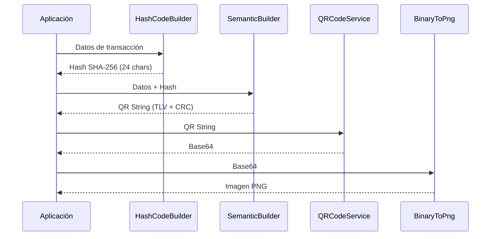

# QR Dinámico con Seguridad

Guía para generar códigos QR dinámicos con hash de seguridad SHA-256, incluyendo generación de imagen PNG.

## Flujo Completo



## Ejemplo Completo

```typescript
import {
  EMVCoContentSemanticBuilder,
  HashCodeBuilder,
  EMVField,
  QRCodeService,
  BinaryToPng,
} from "emvcode";
import * as fs from "node:fs";

async function generarQRDinamicoSeguro() {
  const ACQUIRER = "COM.CO.MIPAGO";
  const merchantId = "123456789";
  const transactionId = `TRX-${Date.now()}`;
  const amount = "75000";

  // 1. Generar hash de seguridad
  const securityHash = await new HashCodeBuilder()
    .setUniqueCode(merchantId)
    .setChannel("POS")
    .setTerminalId("TERM-001")
    .setTransactionId(transactionId)
    .setTransactionAmount(amount)
    .build();

  // 2. Construir QR EMVCo
  const emv = new EMVCoContentSemanticBuilder();

  const qrString = emv
    .setPayloadFormatIndicator("01")
    .setDynamicQR()
    .setMerchantAccountGUI(`${ACQUIRER}.LLA`)
    .setMerchantAccountId(merchantId, EMVField.MERCHANT_ACCOUNT_MERCHANT_ID)
    .setNetworkGUI(`${ACQUIRER}.RED`)
    .setNetworkId("FULL")
    .setMerchantCodeGUI(`${ACQUIRER}.CU`)
    .setMerchantCode(merchantId)
    .setMerchantCategoryCode("5411")
    .setCurrencyISO4217("170")
    .setTransactionAmount(amount)
    .setCountryCode("CO")
    .setMerchantName("SUPERMERCADO LA ECONOMIA")
    .setMerchantCity("CALI")
    .setPostalCode("760001")
    .setChannelGui(`${ACQUIRER}.CHANNEL`)
    .setChannel("POS")
    .setTransactionIdGui(`${ACQUIRER}.TRXID`)
    .setTransactionId(transactionId)
    .setSecurityHashGui(`${ACQUIRER}.SEC`)
    .setSecurityHash(securityHash)
    .setAdditionalTerminalLabel("CAJA-01")
    .setLanguagePreference("en")
    .setMerchantNameAlt("SUPERMARKET THE ECONOMY")
    .build();

  // 3. Generar imagen QR
  const qrBase64 = QRCodeService.createBase64({
    content: qrString,
    width: 300,
    errorCorrectionLevel: "L",
  });

  const trimmedBase64 = qrBase64.slice(2);
  const binaryRaw = BinaryToPng.base64ToBinary(trimmedBase64);
  const binary = binaryRaw.replaceAll(/\s+/g, "");
  const rows = Math.floor(Math.sqrt(binary.length));
  const matrixBits = binary.slice(0, rows * rows);

  const png = await BinaryToPng.binaryToPNG({
    binary: matrixBits,
    rows,
    reversed: true,
  });

  fs.writeFileSync("qr-pago.png", Buffer.from(png));

  return {
    qrString,
    transactionId,
    securityHash,
    imagePath: "qr-pago.png",
  };
}

generarQRDinamicoSeguro().then(console.log);
```

## Validación del QR Recibido

Del lado del receptor, puedes validar la integridad del QR:

```typescript
import { CRCService } from "emvcode";

function validarQR(qrString: string): boolean {
  // Validar CRC
  if (!CRCService.validateCRC16(qrString)) {
    console.error("CRC inválido — QR posiblemente corrupto");
    return false;
  }

  // Validar formato mínimo
  if (!qrString.startsWith("0002")) {
    console.error("Formato de payload inválido");
    return false;
  }

  return true;
}
```

## Ver También

- [HashCodeBuilder](../api/hash-service) — API del generador de hashes
- [QRCodeService](../api/qr-service) — API de generación de imágenes QR
- [QR con Impuestos](qr-with-taxes) — Agregar información tributaria
