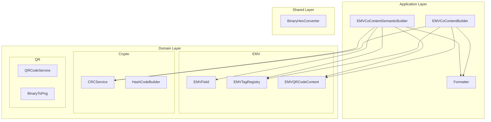

# Introducción a EMVCode

Bienvenido a la documentación de **EMVCode** — una librería TypeScript completa para trabajar con códigos QR EMVCo.

## ¿Qué es EMVCo?

EMVCo es el organismo técnico global que gestiona las especificaciones EMV, utilizadas en la industria de pagos para garantizar la interoperabilidad entre dispositivos, terminales y redes de pago. El estándar **EMVCo QR Code** define cómo se estructuran los datos dentro de un código QR para pagos.

Un código QR EMVCo es una cadena de texto con formato TLV (Tag-Length-Value):

```
┌──────────────────────────────────────────────┐
│  Tag (2 dígitos) + Length (2 dígitos) + Value │
│  Ejemplo: 00 02 01                            │
│           ── ── ──                            │
│           Tag Len Value                       │
│           "Payload Format Indicator = 01"     │
└──────────────────────────────────────────────┘
```

## ¿Qué es EMVCode?

EMVCode es una librería que abstrae toda la complejidad del estándar EMVCo QR Code, permitiéndote:

- Construir códigos QR de pago con una API fluida (Builder Pattern)
- Usar métodos semánticos en lugar de tags numéricos crípticos
- Calcular y validar CRC16-CCITT automáticamente
- Generar hashes de seguridad SHA-256 para transacciones
- Crear imágenes QR en Base64 y PNG

## Características Principales

- 💳 **Estándar EMVCo v1.4**: Cumple con la especificación completa incluyendo tags propietarios Colombia
- 🏗️ **Dos Builders**: Builder básico por tags y Builder semántico con métodos descriptivos
- 🔒 **CRC16-CCITT**: Cálculo y validación automática de checksums
- 🔐 **SHA-256**: Generación de hashes de seguridad para transacciones
- 📱 **QR Generation**: Genera imágenes QR en Base64 y PNG
- 🔄 **Binary/Hex**: Utilidades de conversión entre formatos
- 📦 **TypeScript First**: Tipado completo, autocompletado y seguridad de tipos
- 🌐 **Multiplataforma**: Compatible con Node.js y navegadores modernos

## Arquitectura

EMVCode sigue una arquitectura limpia en capas:



## Builders Disponibles

### EMVCoContentBuilder (Básico)

Usa tags EMV directamente. Ideal cuando conoces la especificación EMVCo:

```typescript
import { EMVCoContentBuilder } from "emvcode";

const qr = new EMVCoContentBuilder()
  .setTag("00", "01")       // Payload Format Indicator
  .setTag("52", "5411")     // MCC
  .setTag("53", "170")      // COP
  .setTag("58", "CO")       // País
  .setTag("59", "MI TIENDA") // Nombre
  .setTag("60", "BOGOTA")   // Ciudad
  .build();
```

### EMVCoContentSemanticBuilder (Recomendado)

Usa métodos descriptivos. Ideal para legibilidad y mantenimiento:

```typescript
import { EMVCoContentSemanticBuilder } from "emvcode";

const qr = new EMVCoContentSemanticBuilder()
  .setPayloadFormatIndicator("01")
  .setStaticQR()
  .setMerchantCategoryCode("5411")
  .setCurrencyISO4217("170")
  .setCountryCode("CO")
  .setMerchantName("MI TIENDA")
  .setMerchantCity("BOGOTA")
  .build();
```

## ¿Cuándo Usar Cada Builder?

### Usa EMVCoContentBuilder cuando:
- ✅ Conoces bien la especificación EMVCo y los tags numéricos
- ✅ Necesitas máxima flexibilidad para tags personalizados
- ✅ Estás migrando desde otra implementación basada en tags

### Usa EMVCoContentSemanticBuilder cuando:
- ✅ Quieres código más legible y mantenible
- ✅ Tu equipo no está familiarizado con los tags EMVCo
- ✅ Necesitas autocompletado del IDE para descubrir campos disponibles
- ✅ Estás construyendo una aplicación nueva desde cero

## Servicios Disponibles

| Servicio | Descripción |
|----------|-------------|
| **EMVCoContentBuilder** | Builder básico por tags EMV |
| **EMVCoContentSemanticBuilder** | Builder semántico con métodos descriptivos |
| **CRCService** | Cálculo y validación CRC16-CCITT |
| **HashCodeBuilder** | Generación de hashes SHA-256 para seguridad |
| **QRCodeService** | Generación de imágenes QR en Base64 |
| **BinaryToPng** | Conversión de QR Base64 a PNG |
| **BinaryHexConverter** | Conversión entre binario y hexadecimal |

## Compatibilidad

- ✅ Node.js 16+
- ✅ Navegadores modernos (con Web Crypto API)
- ✅ TypeScript 5.0+

## Versión Actual

**Versión**: 0.1.0

**Estado**: Funcional ✅
- ✅ Builder básico por tags
- ✅ Builder semántico completo
- ✅ CRC16-CCITT
- ✅ Hash SHA-256
- ✅ Generación de QR Base64 y PNG
- ✅ Tags propietarios Colombia (80-99)
- ✅ Soporte Node.js y navegadores

## Comenzando

Elige tu camino:

### 🚀 Inicio Rápido (5 minutos)
Instala y genera tu primer QR de pago:
- [Guía de Inicio Rápido](getting-started/quick-start)

### 📚 Instalación
Requisitos y configuración:
- [Instalación](getting-started/installation)

### 📖 API Reference
Consulta la API completa:
- [EMVCoContentBuilder](api/emv-builder)
- [EMVCoContentSemanticBuilder](api/semantic-builder)
- [CRCService](api/crc-service)
- [HashCodeBuilder](api/hash-service)
- [QRCodeService](api/qr-service)

### 💡 Guías Prácticas
Ejemplos de uso real:
- [QR de Pago con Impuestos](guides/qr-with-taxes)
- [QR Dinámico con Seguridad](guides/dynamic-qr-security)

---

¿Listo para generar códigos QR de pago? ¡Comencemos! 🚀
