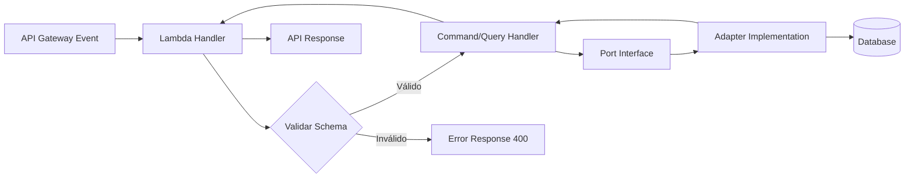

# Visión General de la Arquitectura

El arquetipo implementa la **Arquitectura Hexagonal** (Puertos y Adaptadores) adaptada al contexto serverless de AWS Lambda.

## Principio Fundamental

Las dependencias del código fuente solo apuntan hacia adentro. Las capas externas conocen a las internas, pero nunca al revés.

```
┌─────────────────────────────────────────────┐
│  Entrypoints (Lambda Handlers)              │  ← Capa Externa
│  Reciben eventos, validan, delegan          │
├─────────────────────────────────────────────┤
│  Domain (Commands, Queries, Ports, Model)   │  ← Capa Interna
│  Lógica de negocio pura                     │
├─────────────────────────────────────────────┤
│  Adapters (Implementaciones de Ports)       │  ← Capa Externa
│  Acceso a BD, APIs externas                 │
├─────────────────────────────────────────────┤
│  Libraries (Infraestructura transversal)    │  ← Soporte
│  Logger, Tracer, Metrics, ORM              │
└─────────────────────────────────────────────┘
```

## Estructura de Carpetas

```
app/
├── adapters/              # Implementaciones de los puertos
│   ├── database-driver-repository.ts
│   └── tests/unit/
├── domain/                # Lógica de negocio pura
│   ├── Builders/          # Builders (ApiResponseBuilder)
│   ├── command/           # Comandos de escritura (CQRS)
│   │   ├── create_product/
│   │   ├── update_product/
│   │   └── delete_product/
│   ├── queries/           # Consultas de lectura (CQRS)
│   │   └── search_product/
│   ├── model/             # Entidades de dominio
│   ├── ports/             # Interfaces (contratos)
│   ├── constants/         # Constantes del dominio
│   └── exceptions/        # Excepciones de dominio
├── entrypoints/           # Puntos de entrada
│   ├── lambda/            # Handlers de Lambda
│   │   ├── product/       # Handlers individuales
│   │   └── products-handler.ts  # Composición y exports
│   ├── schemas/           # Schemas Zod de validación
│   └── tests/unit/
└── libraries/             # Librerías e infraestructura
    ├── orm/internals/     # Configuraciones de BD
    ├── logger.ts
    ├── tracer.ts
    ├── metrics.ts
    └── lambda_instance_builder.ts
```

## Flujo de Datos



1. **API Gateway** envía el evento a la función Lambda
2. El **Handler** (entrypoint) valida el schema con Zod
3. Delega al **Command/Query Handler** (domain)
4. El handler usa el **Port** (interface) para acceder a datos
5. El **Adapter** implementa el port con la tecnología concreta
6. La respuesta se construye con **LambdaResponseBuilder**

## Path Aliases

El proyecto usa path aliases de TypeScript para imports limpios:

| Alias | Ruta Real | Uso |
|-------|-----------|-----|
| `@domain/*` | `app/domain/*` | Lógica de negocio |
| `@adapters/*` | `app/adapters/*` | Implementaciones |
| `@lambda/*` | `app/entrypoints/lambda/*` | Handlers |
| `@schemas/*` | `app/entrypoints/schemas/*` | Schemas Zod |
| `@libraries/*` | `app/libraries/*` | Infraestructura |
| `@ports/*` | `app/domain/ports/*` | Interfaces |
| `@model/*` | `app/domain/model/*` | Entidades |

```typescript
// En lugar de:
import type Product from '../../../domain/model/product';

// Usamos:
import type Product from '@model/product';
```

## Próximos Pasos

- [Capas en Detalle](layers) — Profundiza en cada capa
- [Agregar Handlers](../guides/adding-handlers) — Extiende el arquetipo
