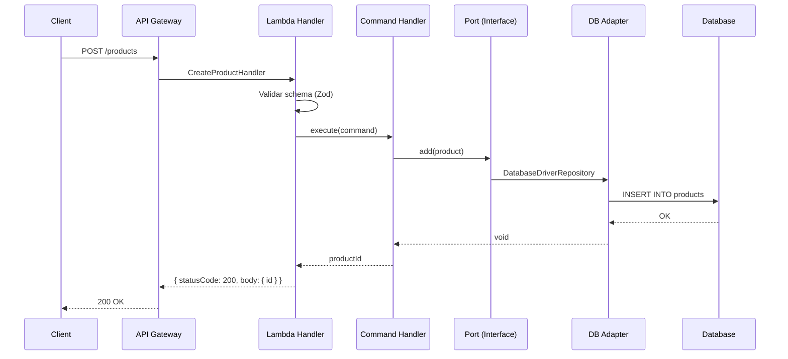

# Inicio Rápido

¡Ejecuta tu primera Lambda con arquitectura hexagonal en 10 minutos!

## Requisitos Previos

- Node.js 18+
- Docker activo
- AWS SAM CLI instalado

## Paso 1: Instalar el Arquetipo

```bash
bash <(curl -s https://raw.githubusercontent.com/jhonGriGi/node-hexagonal-archetype/refs/heads/main/install-script.bash)
```

Selecciona "Install with example code" y elige tu gestor de paquetes.

## Paso 2: Compilar el Proyecto

```bash
npm run compile
```

## Paso 3: Ejecutar Tests

```bash
npm run test
```

Deberías ver todos los tests pasando:

```
PASS  app/adapters/tests/unit/database-driver-repository.test.ts
  database-driver-repository test suit
    ✓ should call list method
    ✓ should call add method
    ✓ should call update method
    ✓ should call delete method
    ✓ should call get method
```

## Paso 4: Invocación Local con SAM

Asegúrate de que Docker esté activo:

```bash
# Linux
sudo systemctl is-active docker

# macOS/Windows: verifica que Docker Desktop esté corriendo
```

Invoca la función Lambda localmente usando un evento de ejemplo:

```bash
# Obtener todos los productos
sam local invoke GetProductsFunction --event events/get-all-products.json

# Obtener un producto por ID
sam local invoke GetProductsFunction --event events/get-product.json

# Crear un producto
sam local invoke PostProductsFunction --event events/create-product.json

# Actualizar un producto
sam local invoke PutProductsFunction --event events/update-product.json

# Eliminar un producto
sam local invoke DeleteProductsFunction --event events/delete-product.json
```

## Paso 5: Construir con SAM

```bash
sam build
```

SAM usa esbuild para compilar y minificar el código TypeScript.

## Paso 6: Desplegar a AWS

```bash
sam deploy --guided
```

El asistente te pedirá:
- **Stack Name**: Nombre de la pila en CloudFormation
- **AWS Region**: Región de despliegue
- **Parameter USER_DB**: Usuario de base de datos
- **Parameter PASSWORD_DB**: Contraseña de base de datos
- **Parameter HOST_DB**: Host de base de datos
- **Parameter PORT_DB**: Puerto de base de datos
- **Parameter DATABASE_DB**: Nombre de base de datos

Después del primer despliegue, solo necesitas ejecutar:

```bash
sam deploy
```

## Lo que has Construido

El arquetipo incluye un CRUD completo de productos con 4 funciones Lambda:

| Función | Método | Path | Descripción |
|---------|--------|------|-------------|
| `GetProductsFunction` | GET | `/products` | Listar todos los productos |
| `GetProductsFunction` | GET | `/products/{id}` | Obtener producto por ID |
| `PostProductsFunction` | POST | `/products` | Crear un producto |
| `PutProductsFunction` | PUT | `/products` | Actualizar un producto |
| `DeleteProductsFunction` | DELETE | `/products/{id}` | Eliminar un producto |

## Probar la API Desplegada

Después del despliegue, SAM muestra las URLs de los endpoints:

```bash
# Crear producto
curl -X POST https://<api-id>.execute-api.<region>.amazonaws.com/Prod/products \
  -H "Content-Type: application/json" \
  -d '{"name": "Laptop", "description": "Laptop gaming 16GB RAM"}'

# Listar productos
curl https://<api-id>.execute-api.<region>.amazonaws.com/Prod/products

# Obtener producto
curl https://<api-id>.execute-api.<region>.amazonaws.com/Prod/products/{id}

# Actualizar producto
curl -X PUT https://<api-id>.execute-api.<region>.amazonaws.com/Prod/products \
  -H "Content-Type: application/json" \
  -d '{"id": "<uuid>", "name": "Laptop Pro", "description": "Laptop gaming 32GB RAM"}'

# Eliminar producto
curl -X DELETE https://<api-id>.execute-api.<region>.amazonaws.com/Prod/products/{id}
```

## Flujo de una Request



## Próximos Pasos

- [Visión General de la Arquitectura](../architecture/overview) — Entiende las capas
- [Agregar Handlers](../guides/adding-handlers) — Crea tus propios endpoints
- [Adaptadores de Base de Datos](../guides/database-adapters) — Configura tu BD
- [Configuración](../reference/configuration) — SAM, TypeScript, ESLint, Jest
