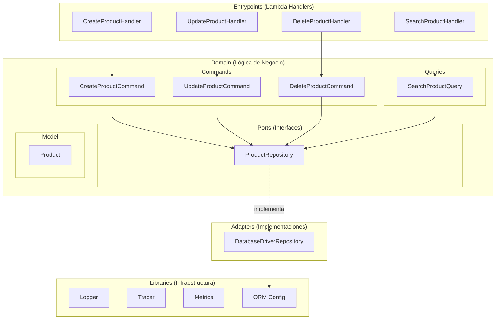

# Introducción al Arquetipo Node.js Hexagonal

Bienvenido a la documentación del **Arquetipo Node.js Hexagonal** — un proyecto base serverless con AWS SAM para crear funciones Lambda siguiendo arquitectura limpia.

## ¿Qué es este Arquetipo?

Es un proyecto base pensado como punto de partida para aplicaciones serverless en AWS con Node.js y TypeScript. Implementa la [Arquitectura Hexagonal de AWS](https://docs.aws.amazon.com/es_es/prescriptive-guidance/latest/hexagonal-architectures/hexagonal-architectures.pdf) (Puertos y Adaptadores) con separación clara de responsabilidades.

Los usuarios tienen total libertad para personalizarlo, agregar o eliminar funcionalidades según las necesidades de sus proyectos.

## Características Principales

- 🏗️ **Arquitectura Hexagonal**: Separación en capas domain, adapters, entrypoints y libraries
- ⚡ **AWS SAM**: Despliegue serverless con AWS Lambda y API Gateway
- 📦 **TypeScript**: Tipado completo con path aliases (`@domain/*`, `@adapters/*`, etc.)
- 🔒 **Validación con Zod**: Schemas de validación para requests y responses
- 📊 **Observabilidad**: Logger estructurado, Tracer y Metrics integrados
- 🧪 **Testing con Jest**: Configuración lista para tests unitarios con cobertura
- 🎯 **Patrones de Diseño**: Factory, Proxy, Builder integrados
- 🔧 **ESLint + Prettier**: Linting y formateo con configuración Antfu
- 🗄️ **ORM Flexible**: Soporte para Sequelize, SQLite y extensible a otros drivers

## Arquitectura

El arquetipo sigue la arquitectura hexagonal de AWS, organizando el código en capas concéntricas:



## Stack Tecnológico

| Tecnología | Uso |
|------------|-----|
| **TypeScript** | Lenguaje principal |
| **AWS SAM** | Framework serverless |
| **AWS Lambda** | Compute |
| **API Gateway** | Entry point HTTP |
| **Zod** | Validación de schemas |
| **Loggerfy** | Logging estructurado |
| **Sequelize** | ORM para bases de datos |
| **Jest** | Testing |
| **ESBuild** | Bundling |
| **ESLint (Antfu)** | Linting y formateo |

## Patrones de Diseño

El arquetipo implementa tres patrones clave:

- **Factory**: Para la creación de conexiones a base de datos mediante la interfaz `DatabaseConfig`
- **Proxy**: Para la implementación de librerías externas (Logger, Tracer, Metrics), reduciendo el acoplamiento
- **Builder**: Para la construcción de respuestas Lambda con `LambdaResponseBuilder`

```typescript
// Ejemplo del patrón Builder
LambdaResponseBuilder.empty()
    .withStatusCode(200)
    .withHeaders({ 'Content-Type': 'application/json' })
    .withBody({ message: 'Success' })
    .build();
```

## CQRS (Command Query Responsibility Segregation)

El dominio separa las operaciones de escritura (Commands) de las de lectura (Queries):

- **Commands**: `CreateProductCommand`, `UpdateProductCommand`, `DeleteProductCommand`
- **Queries**: `SearchProductQuery`

Cada uno tiene su propio `Handler` que encapsula la lógica de negocio.

## Versión Actual

**Estado**: Funcional ✅
- ✅ CRUD completo de productos (Create, Read, Update, Delete)
- ✅ Arquitectura hexagonal con puertos y adaptadores
- ✅ Validación de schemas con Zod
- ✅ Observabilidad (Logger, Tracer, Metrics)
- ✅ Soporte Sequelize (PostgreSQL) y SQLite
- ✅ Tests unitarios con Jest
- ✅ Scripts de instalación automatizados
- ✅ Despliegue con AWS SAM

## Comenzando

Elige tu camino:

### 🚀 Inicio Rápido (10 minutos)
Instala y ejecuta el arquetipo localmente:
- [Guía de Inicio Rápido](getting-started/quick-start)

### 📚 Instalación
Requisitos y opciones de instalación:
- [Instalación](getting-started/installation)

### 🏗️ Arquitectura
Entiende las capas y el flujo de datos:
- [Visión General](architecture/overview)
- [Capas en Detalle](architecture/layers)

### 📖 Guías
Aprende a extender el arquetipo:
- [Agregar Handlers](guides/adding-handlers)
- [Adaptadores de Base de Datos](guides/database-adapters)
- [Testing](guides/testing)

### 🔧 Referencia
Consulta la configuración y estructura:
- [Estructura del Proyecto](reference/project-structure)
- [Configuración](reference/configuration)
- [Patrones de Diseño](reference/design-patterns)

---

¿Listo para construir aplicaciones serverless con arquitectura limpia? ¡Comencemos! 🚀
