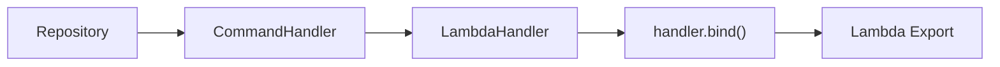
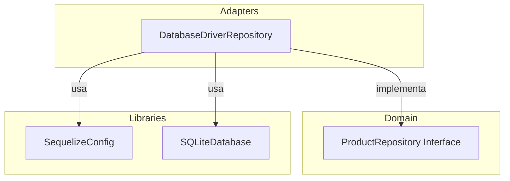

# Patrones de Diseño

El arquetipo implementa varios patrones de diseño para mantener el código desacoplado, testeable y extensible.

## Builder

**Uso**: Construcción de respuestas Lambda.

`LambdaResponseBuilder` permite construir respuestas HTTP de forma fluida, evitando constructores con muchos parámetros:

```typescript
// Sin Builder (propenso a errores)
const response = {
    statusCode: 200,
    headers: { 'Content-Type': 'application/json' },
    body: JSON.stringify({ id: '123' }),
};

// Con Builder (fluido y seguro)
const response = LambdaResponseBuilder.empty()
    .withStatusCode(200)
    .withHeaders({ 'Content-Type': 'application/json' })
    .withBody({ id: '123' })
    .addCookie('session=abc123')
    .build();
```

### API del Builder

| Método | Descripción |
|--------|-------------|
| `empty()` | Crea una nueva instancia (static factory) |
| `withStatusCode(code)` | Establece el código HTTP |
| `withHeaders(headers)` | Agrega headers (merge con existentes) |
| `withBody<T>(body)` | Serializa el body a JSON |
| `addCookie(cookie)` | Agrega una cookie |
| `setCookies(cookies)` | Reemplaza todas las cookies |
| `setBase64Encoding(flag)` | Activa/desactiva encoding Base64 |
| `build()` | Construye el objeto `LambdaApiResponse` |

---

## Factory

**Uso**: Creación de instancias de handlers Lambda.

`createHandler` es una factory function que compone las dependencias y retorna un handler listo para Lambda:

```typescript
function createHandler<C, R>(
    CommandHandlerClass: Constructor<C>,
    HandlerClass: Constructor<LambdaHandlerInterface>,
    repository: R,
) {
    const commandHandler = new CommandHandlerClass(repository);
    const handlerInstance = new HandlerClass(commandHandler);
    return handlerInstance.handler.bind(handlerInstance);
}
```

### Flujo de composición



```typescript
// Uso
export const postProductsHandler = createHandler(
    CreateProductCommandHandler,  // Clase del command handler
    CreateProductHandler,         // Clase del lambda handler
    repository,                   // Instancia del repositorio
);
```

---

## Proxy

**Uso**: Wrappers de librerías externas.

Las clases `LambdaLogger`, `LambdaTracer` y `LambdaMetrics` actúan como proxies que encapsulan las librerías externas, reduciendo el acoplamiento:

```typescript
// Proxy de Logger
class LambdaLogger {
    static info({ code, message, metadata, detail }: LOGGER_PARAMS): void {
        logger.info()
            .setCode(code)
            .setDetail(detail ?? 'lambda_logger')
            .setMessage(message)
            .setMetadata(metadata ?? {})
            .write();
    }
}

// Proxy de Tracer
export class LambdaTracer {
    static getSegment() {
        return tracer.getSegment();
    }
}

// Proxy de Metrics
export class LambdaMetrics {
    static addMetric(name: string, unit: MetricUnit, value: number): void {
        metrics.addMetric(name, unit, value);
    }
}
```

### Beneficio

Si necesitas cambiar `loggerfy` por otra librería de logging, solo modificas `logger.ts`. El resto del código usa `LambdaLogger` y no se ve afectado.

---

## CQRS (Command Query Responsibility Segregation)

**Uso**: Separación de operaciones de escritura y lectura.

El dominio separa Commands (escritura) de Queries (lectura), cada uno con su propio handler:

```
domain/
├── command/                    # Operaciones de escritura
│   ├── create_product/
│   │   ├── command.ts          # Schema Zod (datos de entrada)
│   │   └── command_handler.ts  # Lógica de negocio
│   ├── update_product/
│   └── delete_product/
└── queries/                    # Operaciones de lectura
    └── search_product/
        ├── query.ts
        └── query_handler.ts
```

### Estructura de un Command

```typescript
// 1. Schema de validación (command.ts)
export const CreateProductCommand = z.object({
    name: z.string().min(1),
    description: z.string().min(1),
});

// 2. Handler con lógica de negocio (command_handler.ts)
export class CreateProductCommandHandler {
    constructor(private readonly repository: ProductRepository) {}

    async execute(command: CreateProductCommand): Promise<string> {
        // Lógica de negocio aquí
    }
}
```

---

## Inversión de Dependencias

**Uso**: Desacoplamiento entre capas.

El dominio define interfaces (ports) que los adapters implementan. Las dependencias apuntan hacia el dominio:



```typescript
// El adapter depende de la interfaz, no de una implementación concreta
export class DatabaseDriverRepository implements ProductRepository {
    constructor(private readonly dbConfig: DatabaseConfig) {}
    // ...
}
```

Esto permite:
- Cambiar de base de datos sin modificar la lógica de negocio
- Mockear dependencias fácilmente en tests
- Agregar nuevas implementaciones sin tocar código existente
